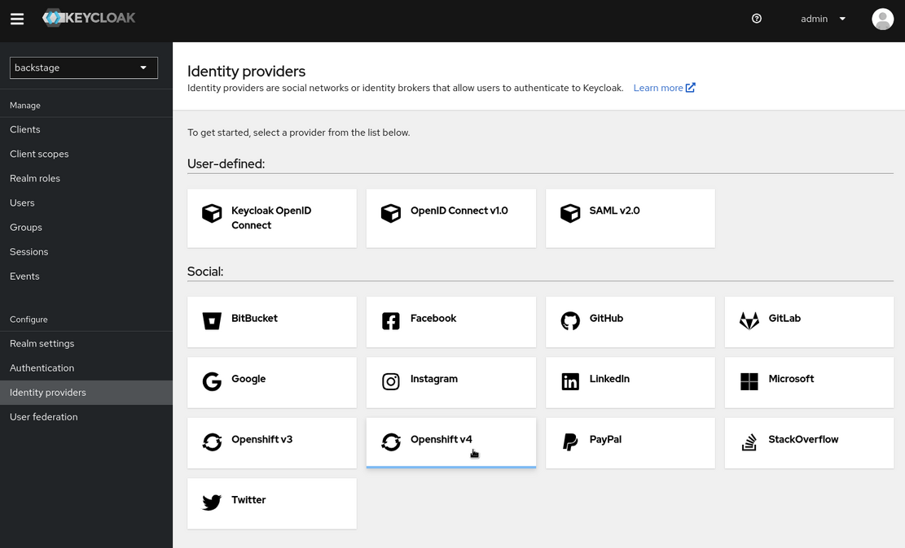

# Backstage uses Keycloak

## The [OpenShift OAuth2Proxy](https://janus-idp.io/blog/using-openshift-authentication-to-secure-access-to-backstage) implementation causes a side-effect in Backstage, where certain APIs (such as the Scaffolder API) are losing their tokens, rendering Backstage useless.
### Backstage is accessible after logging in with OpenShift credentials, the (OpenShift-) user is identified correctly, therefore SSO works on first glance. 
### However, calls to the 
```
/api/scaffolder/v2/templates/default/template/[template]/parameter-schema/api/scaffolder/v2/templates/default/template/[template]/parameter-schema
``` 
### fail with a 401 
```
{"error":{"name":"AuthenticationError","message":"No token specified"},"request":{"method":"GET","url":"/api/scaffolder/v2/templates/default/template/springboot-template/parameter-schema"},"response":{"statusCode":401}}`
```

Using the [Upstream OAuth2Proxy](https://oauth2-proxy.github.io/oauth2-proxy/) works as it should. However, this doesn't know anything about OpenShift, so we are using Keycloak.

If OpenShift was also using Keycloak as OIDC provider, the problem would be solved at this point (OpenShift User = Keycloak User Entity = Backstage User).

However, the automatic provisioning via RHDP creates OpenShift users (= Lab Users `user1..45`).
For this, we are configuring [OpenShift as OAuth provider](https://docs.openshift.com/container-platform/4.12/authentication/using-service-accounts-as-oauth-client.html), which can be federated through Keycloak.



Additionally, Keycloak needs to communicate with OpenShift via SSL/TLS (Keycloak forwards the authentication request to the ServiceAccount via the OCP Master API endpoint) and seemingly doesn't like the Let's Encrypt certificates, as it throws a 

```
org.keycloak.broker.provider.IdentityBrokerException: Could not initialize oAuth metadata
Caused by: javax.net.ssl.SSLHandshakeException: PKIX path building failed: sun.security.provider.certpath.SunCertPathBuilderException: unable to find valid certification path to requested target
```

